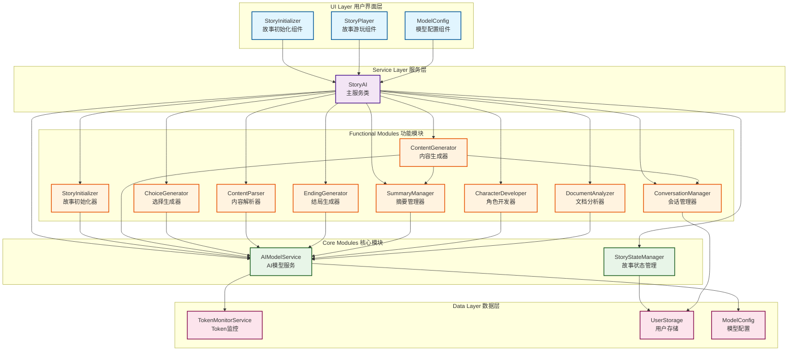
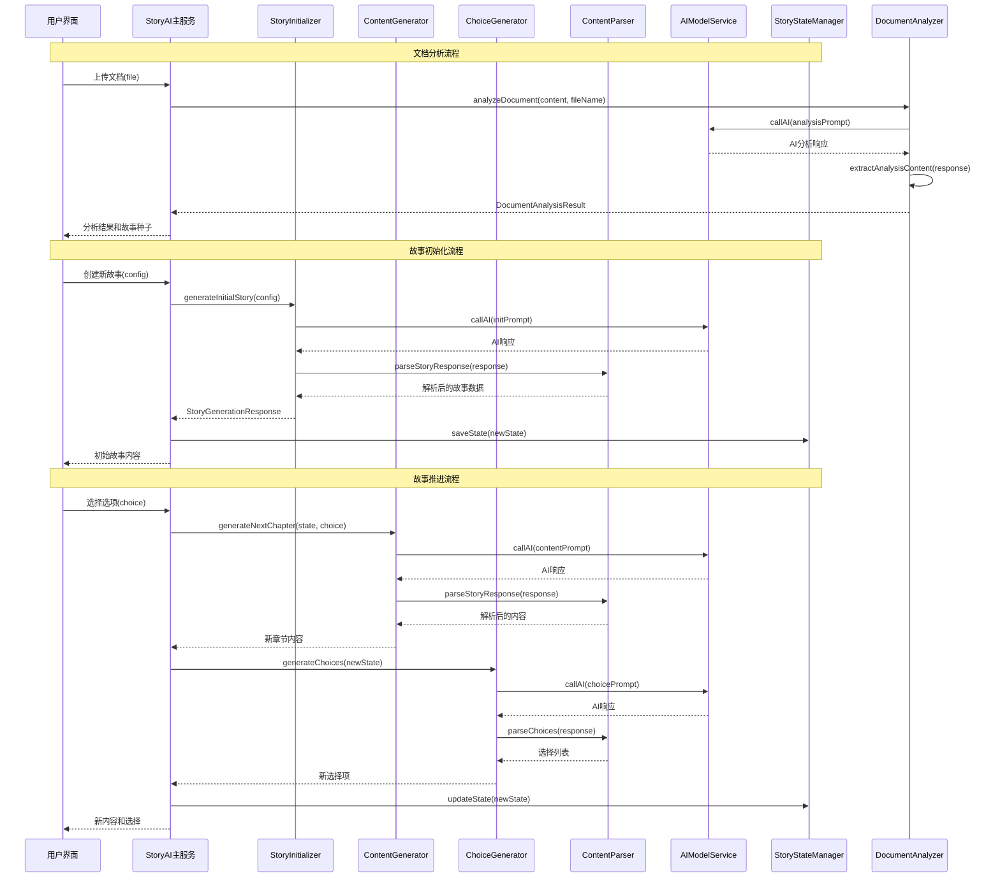

# StoryAI 模块化架构设计文档

## 概述

本文档描述了将现有的庞大 `storyAI.ts` 文件重构为多个专门功能模块的架构设计。新架构旨在提高代码的可维护性、可测试性，并便于后续的算法优化。

## 架构图



## 模块详细说明

### 1. 核心模块 (Core Modules)

#### 1.1 AIModelService - AI模型服务
**职责**: 统一管理所有AI模型调用，提供标准化的AI接口
**功能**:
- AI模型调用封装
- Token消耗监控
- 错误处理和重试机制
- 模型配置管理

**主要方法**:
```typescript
interface AIModelService {
  // 核心AI调用方法
  callAI(prompt: string, systemPrompt?: string, useHistory?: boolean): Promise<AIResponse>;
  
  // 配置管理
  setModelConfig(config: ModelConfig): void;
  getModelConfig(): ModelConfig | null;
  
  // Token管理
  estimateTokens(text: string): number;
  getRemainingTokens(): number;
}
```

**参数说明**:
- `prompt`: 用户提示词
- `systemPrompt`: 系统提示词（可选）
- `useHistory`: 是否使用对话历史（默认true）
- `config`: AI模型配置参数

#### 1.2 StoryStateManager - 故事状态管理
**职责**: 管理故事的整体状态，包括进度、角色、设定等
**功能**:
- 故事状态持久化
- 状态验证和同步
- 跨会话状态恢复

**主要方法**:
```typescript
interface StoryStateManager {
  // 状态管理
  getState(): StoryState;
  setState(state: StoryState): void;
  updateState(updates: Partial<StoryState>): void;
  
  // 持久化
  saveState(userId: string): Promise<void>;
  loadState(userId: string): Promise<StoryState | null>;
  
  // 验证
  validateState(state: StoryState): boolean;
  resetState(): void;
}
```

### 2. 功能模块 (Functional Modules)

#### 2.1 StoryInitializer - 故事初始化器
**职责**: 处理新故事的创建和初始化
**功能**:
- 故事大纲生成
- 初始场景创建
- 角色初始化
- 设定建立

**主要方法**:
```typescript
interface StoryInitializer {
  // 故事生成
  generateInitialStory(config: StoryConfig): Promise<StoryGenerationResponse>;
  generateStoryOutlines(config: StoryConfig): Promise<string[]>;
  
  // 角色创建
  createInitialCharacters(config: StoryConfig): Promise<Character[]>;
  
  // 设定建立
  establishSetting(config: StoryConfig): Promise<string>;
}
```

**参数说明**:
- `config`: 故事配置，包含类型、长度、风格等设定

#### 2.2 ContentGenerator - 内容生成器
**职责**: 生成故事的主体内容
**功能**:
- 章节内容生成
- 场景描述创作
- 对话生成
- 情节推进

**主要方法**:
```typescript
interface ContentGenerator {
  // 内容生成
  generateNextChapter(state: StoryState, choice?: string): Promise<StoryGenerationResponse>;
  generateSceneDescription(context: string): Promise<string>;
  generateDialogue(characters: Character[], context: string): Promise<string>;
  
  // 情节控制
  advancePlot(state: StoryState): Promise<string>;
  buildTension(currentLevel: number, target: number): Promise<string>;
}
```

#### 2.3 ChoiceGenerator - 选择生成器
**职责**: 生成和管理用户选择选项
**功能**:
- 选择项生成
- 难度评估
- 后果预测
- 选择数量优化

**主要方法**:
```typescript
interface ChoiceGenerator {
  // 选择生成
  generateChoices(state: StoryState, context: string): Promise<Choice[]>;
  
  // 选择优化
  determineChoiceCount(state: StoryState): number;
  evaluateChoiceDifficulty(choice: Choice, state: StoryState): number;
  
  // 后果预测
  predictConsequences(choice: Choice, state: StoryState): Promise<string>;
}
```

#### 2.4 ContentParser - 内容解析器
**职责**: 解析和验证AI生成的内容
**功能**:
- JSON格式验证
- 内容结构化
- 错误修复
- 格式标准化

**主要方法**:
```typescript
interface ContentParser {
  // 解析方法
  parseStoryResponse(response: string): StoryGenerationResponse | null;
  parseChoices(response: string): Choice[] | null;
  parseCharacters(response: string): Character[] | null;
  
  // 验证方法
  validateStoryContent(content: any): boolean;
  validateChoiceFormat(choices: any[]): boolean;
  
  // 修复方法
  repairMalformedJSON(jsonString: string): string;
  sanitizeContent(content: string): string;
}
```

#### 2.5 EndingGenerator - 结局生成器
**职责**: 判断故事结束时机并生成结局
**功能**:
- 结束条件检测
- 结局类型判断
- 结局内容生成
- 自定义结局支持

**主要方法**:
```typescript
interface EndingGenerator {
  // 结束判断
  shouldStoryEnd(state: StoryState): boolean;
  determineEndingType(state: StoryState): 'success' | 'failure' | 'neutral' | 'cliffhanger';
  
  // 结局生成
  generateStoryEnding(state: StoryState): Promise<string>;
  generateCustomEnding(state: StoryState, endingType: string): Promise<string>;
  
  // 结局评估
  evaluateStoryCompletion(state: StoryState): number; // 0-100 完成度
}
```

#### 2.6 SummaryManager - 摘要管理器
**职责**: 管理故事历史的智能摘要
**功能**:
- 自动摘要生成
- 摘要合并优化
- 上下文压缩
- 记忆管理

**主要方法**:
```typescript
interface SummaryManager {
  // 摘要生成
  generateSummary(history: ConversationHistory[]): Promise<string>;
  mergeSummaries(oldSummary: string, newSummary: string): string;
  
  // 摘要管理
  shouldTriggerSummary(conversationCount: number): boolean;
  compressHistory(history: ConversationHistory[]): string;
  
  // 摘要解析
  parseSummaryJSON(summaryText: string): SummaryData | null;
  formatSummaryDisplay(summary: string): void;
}
```

#### 2.7 ConversationManager - 会话管理器
**职责**: 管理AI对话历史和上下文
**功能**:
- 对话历史存储
- 上下文窗口管理
- 历史压缩优化
- 会话恢复

**主要方法**:
```typescript
interface ConversationManager {
  // 历史管理
  addToHistory(role: 'system' | 'user' | 'assistant', content: string): void;
  getHistory(): ConversationHistory[];
  clearHistory(): void;
  
  // 上下文管理
  buildContext(includeHistory: boolean): string;
  optimizeContextWindow(): void;
  
  // 会话持久化
  saveConversation(userId: string): Promise<void>;
  loadConversation(userId: string): Promise<ConversationHistory[]>;
}
```

#### 2.8 CharacterDeveloper - 角色开发器
**职责**: 管理和发展故事角色
**功能**:
- 角色创建和发展
- 性格塑造
- 关系管理
- 角色弧线跟踪

**主要方法**:
```typescript
interface CharacterDeveloper {
  // 角色开发
  developCharacter(character: Character, context: string): Promise<Character>;
  createNewCharacter(requirements: string): Promise<Character>;
  
  // 关系管理
  updateCharacterRelationships(characters: Character[]): Promise<Character[]>;
  trackCharacterArc(character: Character, story: StoryState): Promise<string>;
  
  // 角色验证
  validateCharacter(character: Character): boolean;
  mergeCharacterUpdates(existing: Character, updates: Partial<Character>): Character;
}
```

#### 2.9 DocumentAnalyzer - 文档分析器 🆕
**职责**: 分析上传的文档，提取故事元素用于故事创作
**功能**:
- 文档内容解析和分析
- 角色信息提取
- 故事背景识别
- 主题和情节元素分析
- 写作风格识别
- 故事种子生成

**主要方法**:
```typescript
interface DocumentAnalyzer {
  // 文档分析
  analyzeDocument(content: string, fileName: string): Promise<DocumentAnalysisResult>;
  
  // 文件处理
  readFile(file: File): Promise<string>;
  isFileTypeSupported(file: File): boolean;
  getSupportedFileTypesDescription(): string;
  
  // 内容提取
  extractCharacters(content: string): Promise<Character[]>;
  extractSetting(content: string): Promise<SettingInfo>;
  extractThemes(content: string): Promise<ThemeInfo>;
  extractPlotElements(content: string): Promise<PlotInfo>;
  extractWritingStyle(content: string): Promise<StyleInfo>;
  
  // 种子生成
  generateStorySeeds(analysisResult: DocumentAnalysisResult): Promise<StorySeed[]>;
}
```

**参数说明**:
- `content`: 文档文本内容
- `fileName`: 文件名称
- `file`: 上传的文件对象

**分析结果结构**:
```typescript
interface DocumentAnalysisResult {
  success: boolean;
  data?: {
    characters: Character[];           // 提取的角色信息
    setting: {                         // 故事背景设定
      time: string;                    // 时代背景
      place: string;                   // 地理位置
      worldBackground: string;         // 世界观设定
      atmosphere: string;              // 整体氛围
    };
    themes: {                          // 主题分析
      mainThemes: string[];            // 主要主题
      deeperMeaning: string;           // 深层含义
    };
    plotElements: {                    // 情节元素
      mainConflict: string;            // 主要冲突
      keyEvents: string[];             // 关键事件
      plotDevices: string[];           // 叙事手法
      narrativeTechniques: string;     // 叙事技巧
    };
    writingStyle: {                    // 写作风格
      tone: string;                    // 整体语调
      narrativePerspective: string;    // 叙述视角
      genre: string;                   // 文体类型
    };
    suggestedStorySeeds: Array<{       // 建议的故事种子
      title: string;                   // 故事标题
      premise: string;                 // 故事前提
      characters: string[];            // 主要角色
      setting: string;                 // 故事背景
    }>;
  };
  error?: string;
}
```

**支持的文件格式**:
- `.txt` - 纯文本文件
- `.md` - Markdown文件
- `.rtf` - 富文本格式
- `.doc/.docx` - Word文档
- `.pdf` - PDF文档（文本格式）

**核心特性**:
1. **智能角色提取**: 自动识别文档中的真实角色姓名，避免使用"主角"、"男主"等泛指词汇
2. **多轮分析重试**: 确保角色名称提取质量，最多重试3次
3. **内容长度优化**: 对长文档进行智能分段，提取关键部分进行分析
4. **JSON格式验证**: 强化的JSON解析和修复机制
5. **多格式支持**: 支持常见的文档格式上传和解析

## 数据流图



## 接口规范

### 1. 通用接口

```typescript
// 基础响应接口
interface BaseResponse {
  success: boolean;
  error?: string;
  timestamp: string;
}

// AI响应接口
interface AIResponse extends BaseResponse {
  choices?: Array<{
    message: {
      content: string;
      role: string;
    };
  }>;
  usage?: {
    total_tokens: number;
    prompt_tokens: number;
    completion_tokens: number;
  };
}

// 配置接口
interface ModuleConfig {
  enabled: boolean;
  priority: number;
  options: Record<string, any>;
}
```

### 2. 数据类型定义

```typescript
// 对话历史
interface ConversationHistory {
  role: 'system' | 'user' | 'assistant';
  content: string;
  timestamp: string;
  tokens?: number;
}

// 摘要数据
interface SummaryData {
  plot_developments: string[];
  character_changes: Array<{name: string, change: string}>;
  key_decisions: Array<{decision: string, consequence: string}>;
  atmosphere: {
    mood: string;
    tension_level: number;
  };
  important_clues: string[];
  timestamp: string;
  summary_version: number;
}

// 模块状态
interface ModuleState {
  initialized: boolean;
  lastUpdate: string;
  errorCount: number;
  performance: {
    averageResponseTime: number;
    successRate: number;
  };
}
```

## 性能优化策略

### 1. 缓存策略
- **内容缓存**: 缓存常用的故事模板和角色原型
- **响应缓存**: 缓存AI响应以减少重复调用
- **状态缓存**: 本地缓存故事状态，减少数据库访问

### 2. 异步处理
- **后台摘要**: 摘要生成在后台异步执行
- **预加载**: 提前生成可能的选择分支
- **批量处理**: 合并多个AI请求减少网络开销

### 3. 错误处理
- **重试机制**: AI调用失败时的智能重试
- **降级策略**: AI不可用时的备用方案
- **错误恢复**: 自动修复损坏的数据结构

## 测试策略

### 1. 单元测试
- 每个模块独立测试
- Mock AI服务进行测试
- 边界条件和异常情况测试

### 2. 集成测试
- 模块间交互测试
- 端到端故事生成流程测试
- 性能基准测试

### 3. 用户测试
- 故事质量评估
- 用户体验测试
- A/B测试不同算法效果

## 迁移计划

### 阶段1: 核心模块创建
1. 创建 AIModelService 和 StoryStateManager
2. 提取现有功能到新模块
3. 保持向后兼容性

### 阶段2: 功能模块拆分
1. 逐个创建功能模块
2. 重构现有方法
3. 添加新的优化功能

### 阶段3: 整合和优化
1. 更新主服务类
2. 优化模块间通信
3. 性能调优和测试

### 阶段4: 清理和文档
1. 删除旧代码
2. 完善文档
3. 用户指南更新

## 预期收益

1. **可维护性提升**: 代码职责更清晰，修改影响范围更小
2. **可测试性增强**: 模块独立，测试更容易编写和维护
3. **性能优化**: 针对性优化单个模块，效果更明显
4. **扩展性提高**: 新功能开发更容易，不影响现有模块
5. **代码复用**: 模块可在其他项目中复用
6. **团队协作**: 不同开发者可以专注于不同模块

## 风险评估

### 高风险
- **重构复杂度**: 现有代码量大，重构可能引入新bug
- **AI调用变化**: 重构可能影响AI调用的效果

### 中风险  
- **性能影响**: 模块化可能带来微小的性能开销
- **学习成本**: 团队需要时间适应新架构

### 低风险
- **向后兼容**: 可以保持API兼容性
- **渐进迁移**: 可以逐步迁移，降低风险

## 总结

这个模块化重构方案将大幅提升StoryAI系统的架构质量，为后续的功能扩展和算法优化奠定坚实基础。通过清晰的职责分离和标准化的接口设计，系统将更加robust和可维护。